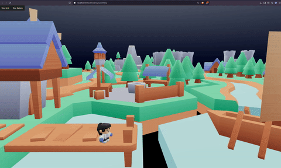

# [@devvienxyz/devvienxyz-portfolio](https://github.com/devvienxyz/devvienxyz-portfolio)

🚧 **Work in Progress**
This project is actively being developed.



## Setup

```bash
nvm use
npm install -g pnpm  # [optional] Skip if pnpm is already installed.
pnpm approve-builds
pnpm install
```

## Development

```bash
pnpm dev
```

See more options and commands, read `/docs/dev_notes.md`.

## Assets & Attribution

HUGE THANKS to Kenney!

Pixel art and game assets provided by [Kenney](https://kenney.nl/assets), licensed under [CC0 1.0 Universal](https://creativecommons.org/publicdomain/zero/1.0/).

Kenney provides high-quality, free-to-use game assets that help bring this project to life.
